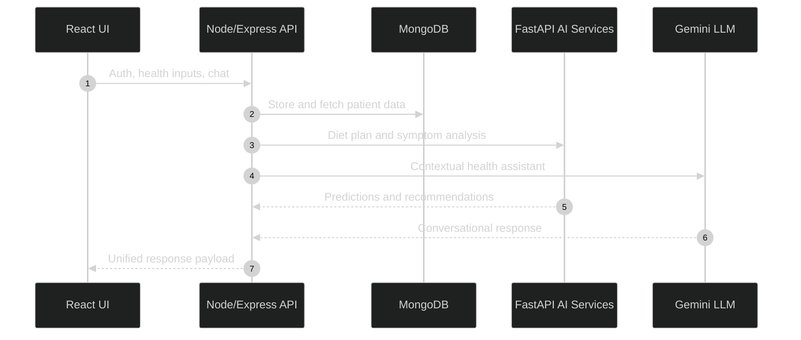
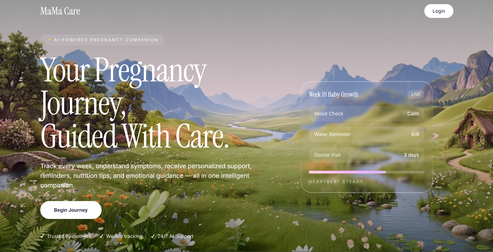

<div align="center">


# MaMa Care
**AI-powered maternal health platform for personalized care, proactive risk insights, and a calmer pregnancy journey.**

<br/>

<!-- Tech Stack Shields (flat-square) -->


<br/><br/>

<!-- Optional dynamic stats -->
<a href="#"></a>
<a href="#"></a>

</div>

---

## Why This Exists
Modern pregnancy care is fragmented. Data lives across apps, visits, and paper notes. **MaMa Care** unifies health tracking, AI-assisted insights, and personalized guidance into a single, secure, developer-friendly platform.

---

## Architecture (System Flow)


---

## Key Features
<div align="center">
<table>
  <tr>
    <td align="center" width="240">
      <br/>
      <b>Health Tracking</b><br/>
      Metrics, trends, and journaling.
    </td>
    <td align="center" width="240">
      <br/>
      <b>AI Guidance</b><br/>
      Smart diet and symptom insights.
    </td>
    <td align="center" width="240">
      <br/>
      <b>Maternal Chatbot</b><br/>
      Context-aware support, 24/7.
    </td>
  </tr>
  <tr>
    <td align="center" width="240">
      <br/>
      <b>Baby Growth</b><br/>
      Weekly progress and milestones.
    </td>
    <td align="center" width="240">
      <br/>
      <b>Risk Insights</b><br/>
      Predictive scoring and alerts.
    </td>
    <td align="center" width="240">
      <br/>
      <b>Secure by Design</b><br/>
      Auth, privacy, and clean APIs.
    </td>
  </tr>
</table>
</div>

---

## Core Logic (Risk Scoring Example)
We model pregnancy risk as a weighted composite from vitals, history, and symptoms:

$$
\text{RiskScore} = \sigma\left(
W_1 \cdot \text{BP} +
W_2 \cdot \text{BMI} +
W_3 \cdot \text{Glucose} +
W_4 \cdot \text{Age} +
W_5 \cdot \text{Symptoms}
\right)
$$

Where $\sigma(x)=\frac{1}{1+e^{-x}}$ ensures a stable, interpretable 0 to 1 risk score.

---

## Quick Start (3 Steps)
1) **Clone and install**
```bash
git clone https://github.com/your-username/mama-care.git
cd mama-care
```

2) **Install dependencies**
```bash
# backend
cd backend && npm install

# frontend
cd ../frontend && npm install

# ai services
cd ../ai_services && pip install -r requirements.txt
```

3) **Run services**
```bash
# backend
cd backend && npm run dev

# frontend
cd ../frontend && npm run dev

# ai services
cd ../ai_services && uvicorn app:app --reload --port 8001
```

---

## Folder Structure
```
mama-care/
├─ ai_services/
│  ├─ app.py
│  ├─ diet_service.py
│  └─ symptom_service.py
├─ backend/
│  ├─ src/
│  │  ├─ routes/
│  │  ├─ models/
│  │  └─ services/
├─ frontend/
│  ├─ src/
│  │  ├─ pages/
│  │  ├─ components/
│  │  └─ context/
```

---

## Tech Stack (Mouth-Watering Grid)
<div align="center">
<table>
  <tr>
    <td></td>
    <td></td>
    <td></td>
  </tr>
  <tr>
    <td></td>
    <td></td>
    <td></td>
  </tr>
</table>
</div>

---

## Roadmap
- [x] Auth and onboarding flow
- [x] Health tracking and trends
- [x] AI diet planning
- [x] Symptom analysis
- [ ] LLM personalization feedback loop
- [ ] Doctor portal integrations
- [ ] Offline-first mobile experience

---

## Screenshot
<div align="center">

</div>

---

## License
MIT - build responsibly and care for patients.
