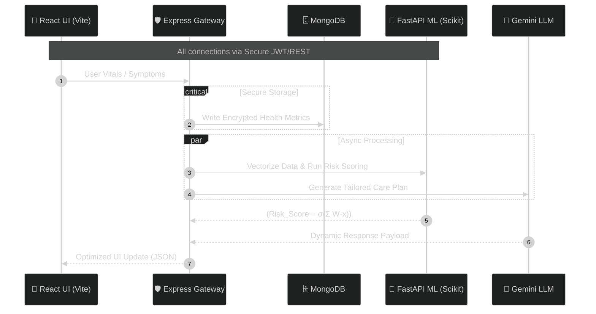

<div align="center">
    
    <div><strong>MaMa Care</strong></div>
    <div>The AI-driven nexus for personalized maternal health, proactive risk synthesis, and a calmer pregnancy odyssey.</div>
    <div>
        
        
        
        
    </div>
</div>

🖥️ The Interface (Mouth-Watering UI)
<div align="center">
    <a href="#">
        
    </a>
    <em>A glassmorphic dashboard showcasing real-time vitals, AI insights, and maternal alerts.</em>
</div>

💡 The Problem
Modern pregnancy care is fragmented, analog, and reactive. Vital health data is scattered across apps, physical notes, and clinical records, creating a massive information gap. MaMa Care synthesizes tracking, intelligence, and guidance into a single, cohesive, developer-friendly ecosystem.

⚙️ System Intelligence Architecture


🌟 Mind-Bending Capabilities
<div align="center">
    <table style="border: 1px solid rgba(139, 233, 253, 0.1); border-radius: 12px; overflow: hidden; background-color: #0b0f1a;">
        <tr>
            <td align="center" width="260" style="padding: 20px;"><b>Precision Tracking</b><em>Unified, granular vitals monitoring.</em></td>
            <td align="center" width="260" style="padding: 20px;"><b>Cognitive Insights</b><em>Symptom clustering and interpretation.</em></td>
            <td align="center" width="260" style="padding: 20px;"><b>24/7 Care Agent</b><em>Context-aware clinical support.</em></td>
        </tr>
        <tr>
            <td align="center" width="260" style="padding: 20px;"><b>Predictive Scoring</b><em>Real-time Multi-Factor Risk Index.</em></td>
            <td align="center" width="260" style="padding: 20px;"><b>Privacy-First DB</b><em>Encrypted, granular data control.</em></td>
            <td align="center" width="260" style="padding: 20px;"><b>Trend Analysis</b><em>Deep learning on vital history.</em></td>
        </tr>
    </table>
</div>

🔬 Core Mathematics: Risk Matrix
We calculate maternal risk using a weighted sigmoid projection, normalizing diverse health indicators into a unified 0-1 risk coefficient for clinical actionability:
$$\text{RiskScore} = \underbrace{\sigma\left(
\mathbf{w}^\top \mathbf{x}
\right)}_{\text{Sigmoid Activation}} =
\frac{1}{1+e^{-\left(
W_1 \text{BP} +
W_2 \text{Age} +
W_3 \text{BMI} +
W_4 \text{Glucose} +
W_5 \text{Symptoms}
\right)}}$$

⚡ Quick Start & Matrix Structure
Installation (3 Steps)

Repository Setup
```bash
git clone https://github.com/your-username/mama-care.git && cd mama-care
```

Backend Services
```bash
(cd backend && npm install) && (cd ai_services && pip install -r requirements.txt)
```

Frontend Application
```bash
(cd frontend && npm install)
```

Launch Sequence
```bash
# Gateway
cd backend && npm run dev
```
```bash
# ML Engine
cd ai_services && uvicorn app:app --reload --port 8001
```
```bash
# Application
cd frontend && npm run dev
```

Folder Matrix
```bash
# Run this to view the clean project tree
tree -I 'node_modules|__pycache__'

mama-care/
├─ ai_services/ # FastAPI, ML Models, Vectorization
│  ├─ core/ # Core algorithms & preprocessing
│  ├─ app.py # FastAPI Entrypoint
├─ backend/ # Node/Express API Gateway
│  ├─ src/ # Routes, Models (Mongoose), Controllers
├─ frontend/ # React + Vite (Tailwind UI)
│  ├─ src/ # Pages, Hooks, Context, Components
```

🛠️ The Tech Ecosystem
<div align="center">
    <table>
        <tr>
            <td align="center"><b>UI/UX (Matrix)</b></td>
            <td align="center"><b>Data Nexus</b></td>
            <td align="center"><b>Backend</b></td>
            <td align="center"><b>Intelligence</b></td>
        </tr>
        <tr>
            <td></td>
            <td></td>
            <td></td>
            <td></td>
        </tr>
        <tr>
            <td></td>
            <td></td>
            <td></td>
            <td></td>
        </tr>
    </table>
</div>

👨‍💻 Engineering Core
<div align="center">
    <a href="#"></a>
    <a href="#"></a>
</div>

License: MIT - Built responsibly, deployed ethically.
